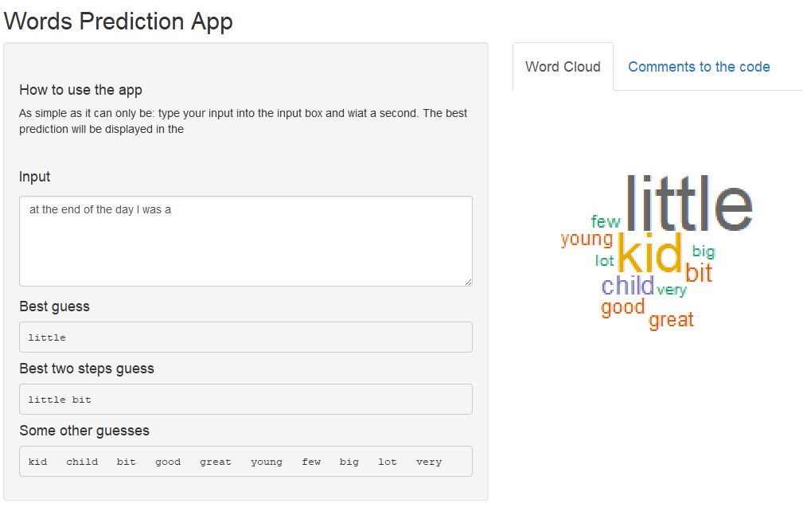

```{r setup, include=FALSE}
knitr::opts_chunk$set(echo = FALSE)
```

## Task Description

 - Build and evaluate a prediction algorithm that takes as input a phrase (multiple words) in a text format and returns the next word.
 
 - Create a Shiny app interface for this algorithm that can be accessed by others.
 
 - Create a slide deck promoting the app (i.e.this presentation).

## Data Preparation {.smaller}

- All three sources - *news, tweets and blogs* - were loaded an cleaned separately using the **tm** package. 
- 2-, 3- and 4-grams were built separately for these three sources. 
- In order to make the size of the predictive model small enough for shiny website, the frequencies were cut off at the value of 5.  
- The last word of the n-grams was dissected for the prediction (value), the rest was used as a key. 
- Also here in order to keep the the size of the model small, for each key at most 10 best predictions were stored.
- For the 3- and 4-grams stopwords removal was performed and these data were stored in addition to the data above.
- At the end **six library-dataframes** were stored: 3 sources with and without stopwords each. 

## Algorithm {.smaller}

- The probability of the input text to be from each of the sources was calculated using 1- and 2-grams.
- Combinations of 1, 2 and 3 words with and without stopwords were built from the end of the input text.
- For each combination predictions were taken from the six created dataframes (see previous slide for info).
- If none were found, an "Ooops!"-message is given.
- If many were found, they were ranked according to their probabilities and up to ten were returned by the app.
- Probabilities used for this purpose are a combination of **count ratios** (#ab/#abc ~ binomial p), scaled with the sample std.dev. (thus taking into account the size of the sample). Priority is given to the predictions using the largest segment of the input, i.e. 3-words case for both with and without stopwords cases. Additionally  probability of the input being from a given source are used to scale data from different source dataframes.

## Shiny App: Link and Print-Screen {.smaller}

Here is a [link to the app](https://smirnovayu.shinyapps.io/WordsPrediction/).

A print screen below shows the layout of the app. On the left there is an input box and three outcome boxes that are updated automatically:

- the most likely word

- the most likely two-words-sequence

- up to 10 other likely words.

On the right a word cloud is generated in forward tab. And the backward tab has info about the app.

```{r, out.width = "300px"}

```